<p align="center">
  <picture>
    <source media="(prefers-color-scheme: dark)" srcset="assets/banner/dark.svg">
    <source media="(prefers-color-scheme: light)" srcset="assets/banner/light.svg">
    
  </picture>
</p>

<p align="center">⋆｡°✩　webcore workspace　✩°｡⋆</p>

<p align="center">
  <a href="https://github.com/asuzey"></a>
  
</p>

<p align="center">──･｡☆*☽*☆.──</p>

## ⋆ about

I build practical software with modern web technologies, automation, and AI-assisted workflows. Most of my service work has been written in Python; my larger projects also include TypeScript and C#.

Currently rebuilding my C# / Unity foundation and learning PHP with Laravel.

<table align="center">
<tr>
<td align="center" width="46%">

<pre>
            へ  ♡
       ૮  &gt;  &lt;)
        /  ⁻  ៸|
     乀(ˍ, ل ل
</pre>

</td>
<td width="54%">

```text
[now]     Laravel & PHP
[rebuild] C# and Unity fundamentals
[always]  useful tools, clean systems,
          and actually shipping things
```

</td>
</tr>
</table>

<p align="center">✦.⁺.✦.⁺.✦</p>

## ⋆ stack

<p align="center">
  
  
  
  
  
</p>
<p align="center">
  
  
  
  
  
</p>

<p align="center">──･｡☆*☽*☆.──</p>

## ⋆ sakura

<p align="center">
  <picture>
    <source media="(prefers-color-scheme: dark)" srcset="assets/sakura/dark.svg">
    <source media="(prefers-color-scheme: light)" srcset="assets/sakura/light.svg">
    
  </picture>
</p>

<p align="center">──･｡☆*☽*☆.──</p>

## ⋆ activity

<p align="center">
  <picture>
    <source media="(prefers-color-scheme: dark)" srcset="assets/stats/dark.svg">
    <source media="(prefers-color-scheme: light)" srcset="assets/stats/light.svg">
    
  </picture>
</p>

<p align="center">
  
</p>

### ⋆ what i've been up to

<!--START_SECTION:activity-->
1. &#11014;&#65039; Pushed 0 commits to [asuzey/asuzey](https://github.com/asuzey/asuzey)
2. &#127793; Created branch `main` in [asuzey/asuzey](https://github.com/asuzey/asuzey)
<!--END_SECTION:activity-->

<p align="center">
  <picture>
    <source media="(prefers-color-scheme: dark)" srcset="https://raw.githubusercontent.com/asuzey/asuzey/output/snake-dark.svg">
    <source media="(prefers-color-scheme: light)" srcset="https://raw.githubusercontent.com/asuzey/asuzey/output/snake-light.svg">
    
  </picture>
</p>

<p align="center">⋆˙⟡ꨄ⟡˙⋆</p>

<p align="center"><sub>crafted with ☕ + code by ASU · <code>python scripts/generate_banner.py</code> · <code>python scripts/make_ascii.py &amp;&amp; python scripts/generate_sakura.py</code></sub></p>
